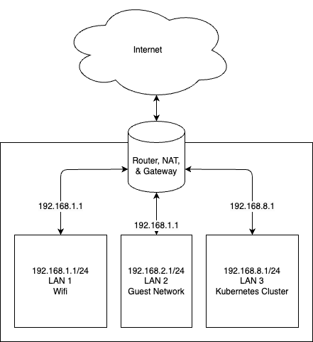

# Moos Pasture

This is a mono repository for my homelab Kubernetes cluster. I strictly adhere to Infrastructure as Code (IaC) and GitOps practices using tools like Kubernetes, Terraform, Talos, Flux, and soon Renovate, and GitHub Actions.

This started as a way for me to house my music collection, but has grown into a fully fledged Kubernetes-based homelab with a dedicated server rack.

## Overview

### Infrastructure

I use [Talos](https://github.com/siderolabs/talos), [Terraform](https://github.com/hashicorp/terraform), and [Proxmox](https://github.com/proxmox) to spin up Kubernetes in a GitOps fashion in [this directory](./infrastructure).

Proxmox, a VM-management technology, is used to spin up VMs in the Proxmox cluster. These raw VMs are bootstrapped via Terraform with Talos configuration(s) that create a functional Kubernetes cluster with the initial cluster components (such as Flux) already deployed.

### Kubernetes

I configure Kubernetes with GitOps via [Flux](https://github.com/fluxcd/flux2). The Flux controllers scans the [kubernetes](./kubernetes/) directory for `kustomization` files to apply to the cluster.

## Inspirations

The [home-operations](https://discord.gg/home-operations) Discord group has been a huge inspiration for this repository, namely these repos:

* <https://github.com/FreekingDean/homelab>
* <https://github.com/onedr0p/home-ops>

One major change from the typical home operations Discord setup is my desire to setup the Kuberntes clusters in VMs. For those repositories, I drew great inspiration from these repos:

* <https://github.com/zimmertr/TJs-Kubernetes-Service>
* <https://github.com/kubebn/talos-proxmox-kaas>
