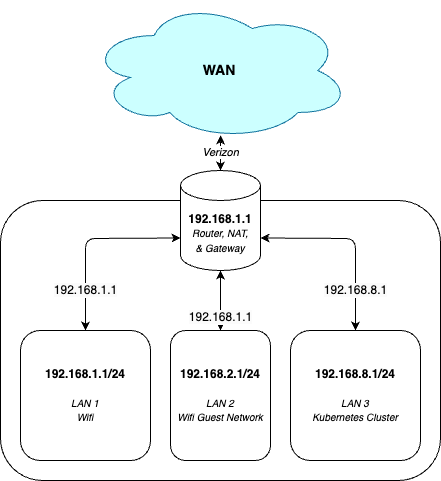

  

 

# [Moo's Pasture](https://github.com/ProfMoo/home)

> A [onedr0p home-ops](https://github.com/onedr0p/home-ops) inspired project, with some [ProfMoo](https://github.com/ProfMoo) sprinkled in.

## Overview

This is a mono repository for my homelab Kubernetes cluster. I strictly adhere to Infrastructure as Code (IaC) and GitOps practices using tools like Kubernetes, Terraform, Talos, Flux, Renovate, and GitHub Actions.

  

### Infrastructure

I use [Talos](https://github.com/siderolabs/talos), [Terraform](https://github.com/hashicorp/terraform), and [Proxmox](https://github.com/proxmox) to spin up Kubernetes in a GitOps fashion in [this directory](./infrastructure).

Proxmox, a VM-management technology, is used to spin up VMs in the Proxmox cluster. These raw VMs are bootstrapped via Terraform with Talos configuration(s) that create a functional Kubernetes cluster with the initial cluster components (such as Flux) already deployed.

### Kubernetes

I configure Kubernetes with GitOps via [Flux](https://github.com/fluxcd/flux2). The Flux controllers scans the [kubernetes](./kubernetes/) directory for `kustomization` files to apply to the cluster.

## Inspirations

The [home-operations](https://discord.gg/home-operations) Discord group has been a huge inspiration for this repository, namely these repos:

* <https://github.com/FreekingDean/homelab>
* <https://github.com/onedr0p/home-ops>

One major change from the typical home operations Discord setup is my desire to setup the Kuberntes clusters in VMs. For those repositories, I drew great inspiration from these repos:

* <https://github.com/zimmertr/TJs-Kubernetes-Service>
* <https://github.com/kubebn/talos-proxmox-kaas>

## TODO

1. [X]  Fix weird error where only *some* of the API server and kubelet logs are getting scraped.
   1. Ongoing... believe it's due to the `aud` field being incorrectly assigned from the API server.
2. [ ] Remove unnecessary Grafana dashboards.
   1. [ ] Fix Grafana. Lots of dashboards were broken with a recent upgrade.
3. [ ] ~~Setup TrueNAS storage~~. Actually, just do Ceph/Rook with Volsync natively on the nodes for PVCs.
4. [X] Fix Renovate (currently, it doesn't really work consistently and uses ProfMoo Github credentials instead of its own). Also, I should setup Renovate to handle the Helm chart versions.
5. [X] Install cert-manager, nginx-ingress, and MetalLB (or equivalent). This way I can have a consistent URL for my important endpoints.
6. [X] Fix the bootstrapping phase to be more consistent and upgradeable for Flux
7. [ ] Figure out the correct way to expose endpoints outside my local network (via Cloudflare)
8. [ ] Move over all applications from windows machine:
   1. [ ] Betanin (needs custom Docker build)
   2. [ ] Jellyfin (needs GPU)
   3. [ ] Roon (might need a completely different setup to accomplish this)
